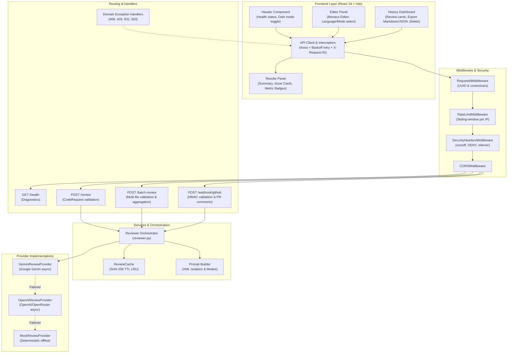

# System Architecture Document
## AI Code Review System

**Version:** 1.1.0  
**Date:** 2026-09-20  
**Status:** Full-Stack v1.1.0 Complete (Production-Ready with Batch Review, Webhooks, History, and Exports)

---

## 1. Architecture Overview

The system follows a modern, **async-native full-stack architecture** with built-in caching, rate limiting, multi-provider resilience, GitHub PR webhook automation, batch review capabilities, and a rich, interactive React 19 web interface:

```text
┌─────────────────────────────────┐     HTTP / REST (JSON)     ┌────────────────────────────────────────────────────────┐     API Call     ┌──────────────────┐
│         React 19 Frontend       │  ──────────────────────►  │                    FastAPI Backend                     │  ────────────►  │   Primary AI     │
│   (Vite 8 + Monaco Editor +     │                           │                                                        │                 │ (Google Gemini)  │
│      Tailwind CSS UI)           │  ◄──────────────────────  │  [RateLimiter] ──► [Cache (SHA-256)] ──► [Orchestrator] │  ◄────────────  └──────────────────┘
│   [Vite Proxy /api -> Backend]  │     X-Request-ID + JSON   │                                                        │                          │ (Fallback)
└─────────────────────────────────┘                           └────────────────────────────────────────────────────────┘                          ▼
                                                                  │                 ▲                                              ┌──────────────────┐
                                                    PR Webhook    │                 │ PR Comments                                  │   Secondary AI   │
                                                                  ▼                 │                                              │ (OpenAI / Mock)  │
                                                              ┌────────────────────────┐                                           └──────────────────┘
                                                              │   GitHub REST API /    │
                                                              │   Webhooks Endpoint    │
                                                              └────────────────────────┘
```

---

## 2. Technology Stack

### Frontend Stack

| Layer | Technology | Role & Justification |
|---|---|---|
| **UI Library** | React 19 + TypeScript | Component-driven, type-safe architecture with high performance |
| **Bundler / Build Tool** | Vite 8 | Ultra-fast HMR and optimized ES modules build pipeline |
| **Code Editor** | Monaco Editor (`@monaco-editor/react`) | VS Code-grade code editing with syntax highlighting, line numbers, and theme support |
| **Styling** | Tailwind CSS & PostCSS | Responsive, accessible utility-first design matching dark/light theme tokens |
| **Storage & Export** | LocalStorage API + Blob Downloads | Offline review history (up to 20 items) and Markdown/JSON export generation |
| **HTTP Client** | Axios | Custom interceptors for `X-Request-ID` tracing, error normalization, and exponential backoff retry |
| **Icons** | Lucide React | Clean, scalable UI icons |
| **Testing** | Vitest + React Testing Library + jsdom | 85 comprehensive unit and component test cases across 9 suites |

### Backend Stack

| Layer | Technology | Role & Justification |
|---|---|---|
| **API Framework** | Python 3.10+ & FastAPI | Async-first, high throughput, automatic OpenAPI documentation, Pydantic validation |
| **Data Validation** | Pydantic v2 & Pydantic-Settings | Strict contract validation, type safety, environment configuration |
| **Server** | Uvicorn (ASGI) | Async event-loop worker server |
| **HTTP Client** | HTTPX (Async) | Non-blocking async client for OpenAI, OpenRouter, and GitHub API interactions |
| **AI Providers** | Google GenAI SDK (`google-genai`) | Primary LLM integration (`gemini-2.0-flash` / `gemini-1.5-flash`) |
| **Fallback AI** | OpenAI / OpenRouter & Mock | Automatic failover when primary provider is unavailable |
| **Security & Webhooks** | HMAC-SHA256 (`hashlib`, `hmac`) | Constant-time signature verification for GitHub PR webhooks |
| **Cache** | In-Memory TTL LRU (`hashlib` SHA-256) | Zero-latency deduplication for repeated identical reviews |
| **Rate Limiter** | Sliding-Window IP Limiter | Protects API from denial-of-service and quota exhaustion (HTTP 429) |
| **Logging & Tracing** | JSON Structured Logger + ContextVars | Single-line JSON logs with `X-Request-ID` tracing across requests |
| **Testing** | Pytest + AnyIO | 100% route, provider, cache, batch, and exception test coverage (37 tests) |

---

## 3. System Components

### 3.1 Component Diagram



### 3.2 Component Responsibilities

| Component | Responsibility |
|---|---|
| **Header** | Displays brand identity, dynamic backend health connectivity pill, and theme mode toggle (light/dark). |
| **Editor Panel** | Houses Monaco Editor, language picker (12 languages), review mode selector (4 modes), and keyboard shortcut handler (`Ctrl+Enter` / `Cmd+Enter`). |
| **Results Panel** | Visualizes summary metadata (lines reviewed, execution time, provider, cache indicator), issue counts by severity, and interactive expandable issue cards. |
| **History Dashboard** | Visualizes past review history saved in localStorage with per-item card preview, one-click reload into editor, Markdown/JSON exports, and deletion controls. |
| **API Client (`api.ts`)** | Handles `/api` requests, automatic request ID injection, error normalization into `ApiError`, and exponential retry strategy. |
| **RequestIdMiddleware** | Generates or propagates `X-Request-ID` via contextvars for distributed tracing. |
| **RateLimitMiddleware** | Tracks sliding-window request volume per IP; raises `RateLimitExceededError` (429). |
| **SecurityHeadersMiddleware** | Injects defensive headers (`X-Content-Type-Options: nosniff`, `X-Frame-Options: DENY`, etc.). |
| **Health Router** | `GET /health` diagnostic checks: provider state, model name, cache size, supported modes & languages. |
| **Review Router** | `POST /review` endpoint enforcing input validation and returning rich `ReviewResponse`. |
| **Batch Router** | `POST /batch-review` endpoint processing up to 10 files concurrently with aggregated metrics. |
| **Webhook Router** | `POST /webhook/github` endpoint verifying HMAC-SHA256 signatures, extracting PR diffs, running reviews, and posting PR comments. |
| **Reviewer Orchestrator** | Coordinates cache lookup, prompt construction, primary provider invocation, and fallback cascading. |
| **ReviewCache** | Generates SHA-256 keys from `(code, language, mode, model)` and enforces TTL expiration & LRU capacity. |
| **Prompt Builder** | Wraps code in `<user_code>` XML boundary tags, applies injection guardrails, and appends mode-specific rules. |
| **Exception Handlers** | Maps domain exceptions (`ReviewTimeoutError`, `RateLimitExceededError`, `ProviderError`, `ProviderUnavailableError`) to semantic HTTP status codes. |

---

## 4. API Design & Contracts

### 4.1 Endpoints

| Method | Path | Description | Status Codes |
|---|---|---|---|
| `GET` | `/` | API status and root greeting | `200` |
| `GET` | `/health` | Diagnostics: provider, model, cache size, supported languages/modes | `200` |
| `POST` | `/review` | Submit single code snippet for asynchronous review | `200`, `408`, `422`, `429`, `502`, `503` |
| `POST` | `/batch-review` | Submit batch of up to 10 files for parallel review | `200`, `408`, `422`, `429`, `502`, `503` |
| `POST` | `/webhook/github` | Receive GitHub PR webhook events for automated reviews | `200`, `400`, `401`, `422`, `500` |

### 4.2 Schema Contracts

#### Request: `CodeRequest`
```json
{
  "code": "def calculate_total(items):\n    return sum(item.price for item in items)",
  "language": "python",
  "mode": "performance"
}
```

#### Request: `BatchReviewRequest`
```json
{
  "files": [
    {
      "filename": "app.py",
      "code": "def divide(a, b):\n    return a / b",
      "language": "python",
      "mode": "comprehensive"
    },
    {
      "filename": "utils.js",
      "code": "const add = (a, b) => a + b;",
      "language": "javascript",
      "mode": "style"
    }
  ],
  "default_language": "python",
  "default_mode": "comprehensive"
}
```

#### Response: `BatchReviewResponse`
```json
{
  "total_files": 2,
  "successful_files": 2,
  "failed_files": 0,
  "total_issues": 1,
  "overall_summary": "All 2 files processed successfully with 1 total issue(s) found.",
  "batch_time_ms": 680,
  "results": [
    {
      "filename": "app.py",
      "language": "python",
      "mode": "comprehensive",
      "review": {
        "summary": "Potential ZeroDivisionError detected.",
        "issues": [
          {
            "line": 2,
            "message": "Division by zero risk.",
            "severity": "High",
            "suggestion": "Check if b == 0.",
            "category": "security"
          }
        ],
        "metadata": {
          "language": "python",
          "mode": "comprehensive",
          "lines_reviewed": 2,
          "review_time_ms": 350,
          "provider": "gemini",
          "model": "gemini-2.0-flash",
          "cached": false,
          "request_id": "req-1"
        }
      }
    }
  ]
}
```

---

## 5. Security Architecture

| Vector | Defense Implementation |
|---|---|
| **Prompt Injection** | Code wrapped inside `<user_code>` XML boundary tags with explicit system instructions to treat content strictly as inert data. |
| **Webhook Spoofing** | HMAC-SHA256 signature verification (`X-Hub-Signature-256`) using `hmac.compare_digest` to prevent timing attacks. |
| **Rate Abuse / DoS** | Sliding-window client IP limiter returning HTTP 429 with `Retry-After`. |
| **Payload Bloat** | Pydantic validation strictly caps submissions at 15,000 characters and rejects whitespace-only inputs; Batch endpoint caps submissions at 10 files. |
| **Defensive Headers** | `X-Content-Type-Options: nosniff`, `X-Frame-Options: DENY`, `X-XSS-Protection: 1; mode=block`, and `Referrer-Policy: strict-origin-when-cross-origin`. |
| **Secret Management** | API credentials configured through `.env` via `pydantic-settings`, excluded from git. |
| **Code Execution** | Code is strictly treated as string data and never dynamically evaluated on the host system. |
| **Tracing & Auditing** | `X-Request-ID` attached to all logs, Axios requests, and HTTP response headers for full auditability. |
| **CORS Policy** | Restricted origin communication ensuring safe browser interaction. |

---

## 6. Testing & Quality Assurance

- **Backend (Pytest + AnyIO):** 37 tests across 8 test suites (`test_batch.py`, `test_cache.py`, `test_exceptions.py`, `test_health.py`, `test_integration.py`, `test_prompt_builder.py`, `test_rate_limiter.py`, `test_review.py`).
- **Frontend (Vitest + React Testing Library):** 85 unit and component tests across 9 test suites (`App.test.tsx`, `Header.test.tsx`, `Editor.test.tsx`, `Results.test.tsx`, `IssueCard.test.tsx`, `ReviewHistory.test.tsx`, `exportUtils.test.ts`, `api.test.ts`, `storage.test.ts`).
- **Total Automated Test Count:** **122 automated tests** passing at 100%.
