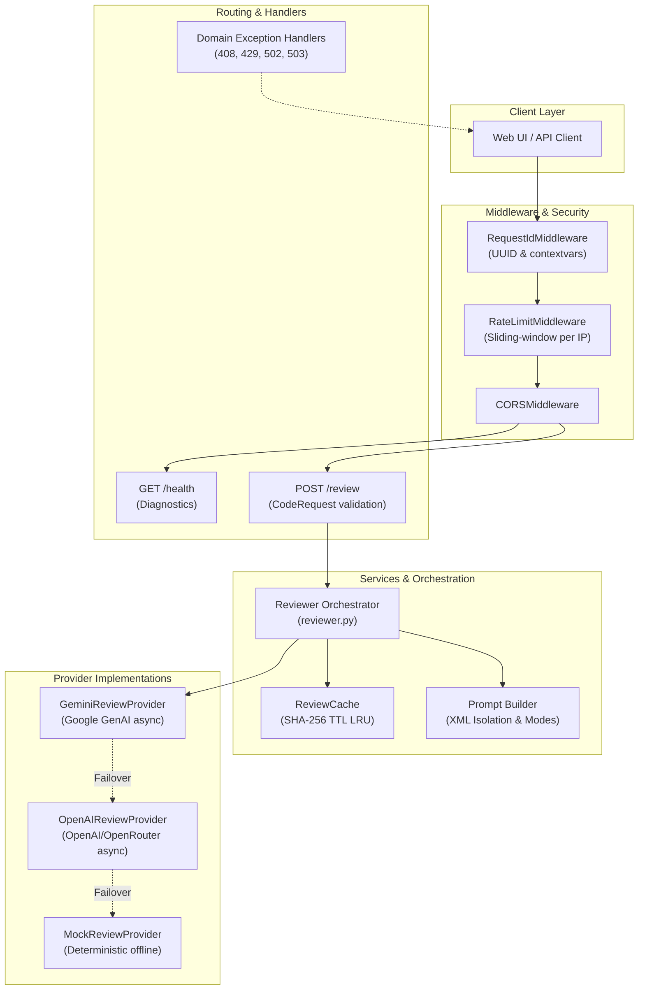
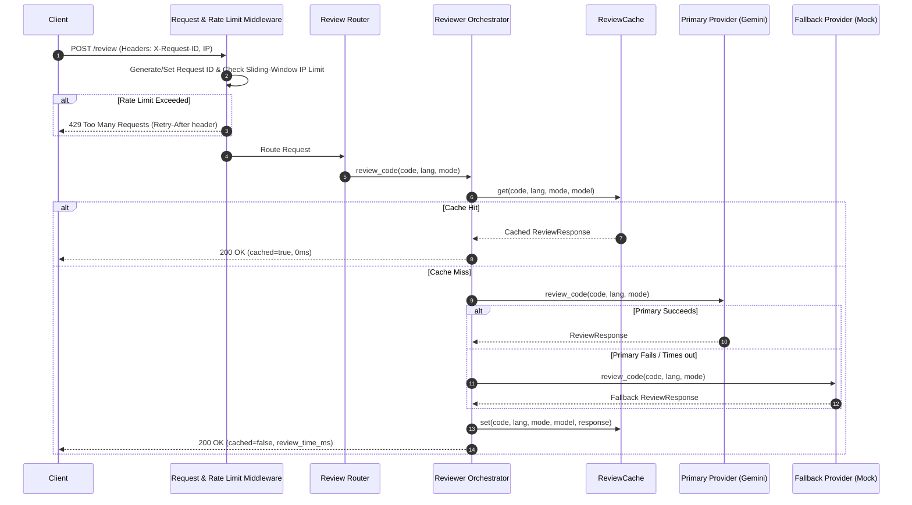

# System Architecture Document
## AI Code Review System

**Version:** 1.0.0  
**Date:** 2026-09-18  
**Status:** Backend v1.0.0 Complete | Frontend In Progress  

---

## 1. Architecture Overview

The system follows a modern, **async-native 3-tier architecture** with built-in caching, rate limiting, and multi-provider resilience:

```text
┌──────────────────┐     HTTP / REST (JSON)     ┌────────────────────────────────────────────────────────┐     API Call     ┌──────────────────┐
│                  │  ──────────────────────►  │                    FastAPI Backend                     │  ────────────►  │   Primary AI     │
│     Frontend     │                           │                                                        │                 │ (Google Gemini)  │
│  (Web / Client)  │  ◄──────────────────────  │  [RateLimiter] ──► [Cache (SHA-256)] ──► [Orchestrator] │  ◄────────────  └──────────────────┘
│                  │     X-Request-ID + JSON   │                                                        │                          │ (Fallback)
└──────────────────┘                           └────────────────────────────────────────────────────────┘                          ▼
                                                                                                                           ┌──────────────────┐
                                                                                                                           │   Secondary AI   │
                                                                                                                           │ (OpenAI / Mock)  │
                                                                                                                           └──────────────────┘
```

---

## 2. Technology Stack

### Backend Stack

| Layer | Technology | Role & Justification |
|---|---|---|
| **API Framework** | Python 3.10+ & FastAPI | Async-first, high throughput, automatic OpenAPI documentation, Pydantic validation |
| **Data Validation** | Pydantic v2 & Pydantic-Settings | Strict contract validation, type safety, environment configuration |
| **Server** | Uvicorn (ASGI) | Async event-loop worker server |
| **HTTP Client** | HTTPX (Async) | Non-blocking async client for OpenAI and OpenRouter endpoints |
| **AI Providers** | Google GenAI SDK (`google-genai`) | Primary LLM integration (`gemini-2.0-flash` / `gemini-1.5-flash`) |
| **Fallback AI** | OpenAI / OpenRouter & Mock | Automatic failover when primary provider is unavailable |
| **Cache** | In-Memory TTL LRU (`hashlib` SHA-256) | Zero-latency deduplication for repeated identical reviews |
| **Rate Limiter** | Sliding-Window IP Limiter | Protects API from denial-of-service and quota exhaustion (HTTP 429) |
| **Logging & Tracing** | JSON Structured Logger + ContextVars | Single-line JSON logs with `X-Request-ID` tracing across requests |
| **Testing** | Pytest + AnyIO | 100% route, provider, cache, and exception test coverage (32 tests) |

---

## 3. System Components

### 3.1 Component Diagram



### 3.2 Component Responsibilities

| Component | Responsibility |
|---|---|
| **RequestIdMiddleware** | Generates or propagates `X-Request-ID` via contextvars for distributed tracing. |
| **RateLimitMiddleware** | Tracks sliding-window request volume per IP; raises `RateLimitExceededError` (429). |
| **Health Router** | `GET /health` diagnostic checks: provider state, model name, cache size, supported modes & languages. |
| **Review Router** | `POST /review` endpoint enforcing input validation and returning rich `ReviewResponse`. |
| **Reviewer Orchestrator** | Coordinates cache lookup, prompt construction, primary provider invocation, and fallback cascading. |
| **ReviewCache** | Generates SHA-256 keys from `(code, language, mode, model)` and enforces TTL expiration & LRU capacity. |
| **Prompt Builder** | Wraps code in `<user_code>` XML boundary tags, applies injection guardrails, and appends mode-specific rules. |
| **Exception Handlers** | Maps domain exceptions (`ReviewTimeoutError`, `RateLimitExceededError`, `ProviderError`, `ProviderUnavailableError`) to semantic HTTP status codes. |

---

## 4. Detailed Backend Architecture

### 4.1 Directory Structure

```text
backend/
├── config.py                   # Pydantic BaseSettings (keys, timeouts, cache TTL, rate limits)
├── exceptions.py               # Custom domain exceptions & FastAPI exception handlers
├── main.py                     # App factory, middlewares, exception handlers, and routing
├── models.py                   # Enums, CodeRequest, ReviewResponse, ReviewMetadata, HealthResponse
├── requirements.txt            # Pinned dependencies
├── routes/
│   ├── __init__.py
│   ├── health.py               # GET /health diagnostics
│   └── review.py               # POST /review endpoint
├── services/
│   ├── __init__.py
│   ├── cache.py                # In-memory TTL SHA-256 review cache (LRU eviction)
│   ├── rate_limiter.py         # Sliding-window IP rate limiter
│   ├── reviewer.py             # Orchestrator with cache lookup & fallback cascade
│   └── providers/
│       ├── __init__.py
│       ├── base.py             # Async BaseReviewProvider
│       ├── gemini.py           # Async Google GenAI provider
│       ├── openai_provider.py  # Async OpenAI / OpenRouter provider
│       └── mock.py             # Deterministic mock provider
└── utils/
    ├── __init__.py
    ├── logger.py               # Structured JSON logger with request context
    └── prompt_builder.py       # Mode prompts with XML injection guardrails
```

### 4.2 Async Provider Interface

All providers adhere to the `BaseReviewProvider` contract:

```python
class BaseReviewProvider(ABC):
    @property
    @abstractmethod
    def provider_name(self) -> str:
        """Identifier for the provider (e.g., 'gemini', 'openai', 'mock')."""
        ...

    @property
    @abstractmethod
    def model_name(self) -> str:
        """Model identifier (e.g., 'gemini-2.0-flash', 'gpt-4o-mini')."""
        ...

    @abstractmethod
    async def review_code(self, code: str, language: str, mode: str) -> ReviewResponse:
        """Analyze code asynchronously and return structured review response."""
        ...
```

---

## 5. API Design & Contracts

### 5.1 Endpoints

| Method | Path | Description | Status Codes |
|---|---|---|---|
| `GET` | `/` | API status and root greeting | `200` |
| `GET` | `/health` | Diagnostics: provider, model, cache size, supported languages/modes | `200` |
| `POST` | `/review` | Submit code for asynchronous review | `200`, `408`, `422`, `429`, `502`, `503` |

### 5.2 Schema Contracts

#### Request: `CodeRequest`
```json
{
  "code": "def calculate_total(items):\n    return sum(item.price for item in items)",
  "language": "python",
  "mode": "performance"
}
```
- `code`: 1 to 15,000 characters, non-whitespace.
- `language`: `python`, `javascript`, `typescript`, `java`, `go`, `rust`, `cpp`, `c`, `csharp`, `php`, `ruby`, `kotlin`.
- `mode`: `comprehensive`, `security`, `performance`, `style`.

#### Response: `ReviewResponse`
```json
{
  "summary": "Code is clean and utilizes generator expressions efficiently.",
  "issues": [],
  "metadata": {
    "language": "python",
    "mode": "performance",
    "lines_reviewed": 2,
    "review_time_ms": 12,
    "provider": "mock",
    "model": "mock-deterministic",
    "cached": false,
    "request_id": "93b16952-1678-4389-9cb1-96d5a109a25b"
  }
}
```

---

## 6. End-to-End Sequence Flow



---

## 7. Security Architecture

| Vector | Defense Implementation |
|---|---|
| **Prompt Injection** | Code wrapped inside `<user_code>` XML boundary tags with explicit system instructions to treat content strictly as inert data. |
| **Rate Abuse / DoS** | Sliding-window client IP limiter returning HTTP 429 with `Retry-After`. |
| **Payload Bloat** | Pydantic validation strictly caps submissions at 15,000 characters and rejects whitespace-only inputs. |
| **Secret Management** | API credentials configured through `.env` via `pydantic-settings`, excluded from git. |
| **Code Execution** | Code is strictly treated as string data and never dynamically evaluated on the host system. |
| **Tracing & Auditing** | `X-Request-ID` attached to all logs and HTTP headers for full auditability. |

---

## 8. Resilience & Fallback Strategy

The backend employs a two-tier resilience architecture:
1. **Primary $\rightarrow$ Fallback Cascade:** Configured via `REVIEW_PROVIDER` (e.g. `gemini`) and `FALLBACK_PROVIDER` (e.g. `mock` or `openai`). If upstream API connectivity fails or times out, the system automatically fulfills the request using the secondary provider without client disruption.
2. **Deterministic Offline Provider:** The mock provider allows continuous development and integration testing without network access or consuming AI tokens.
