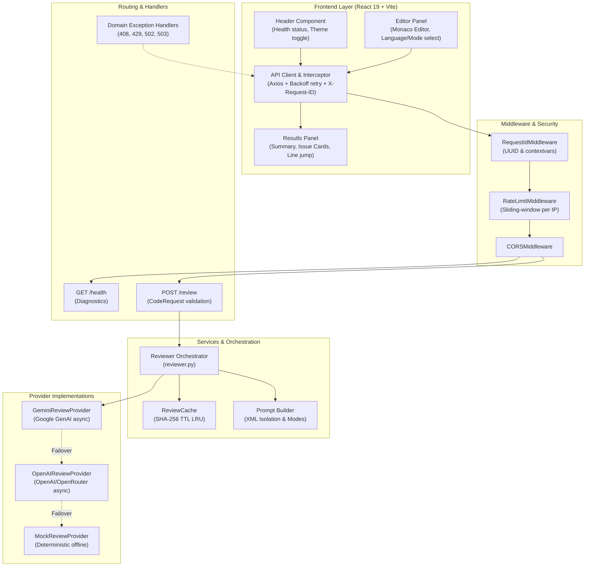
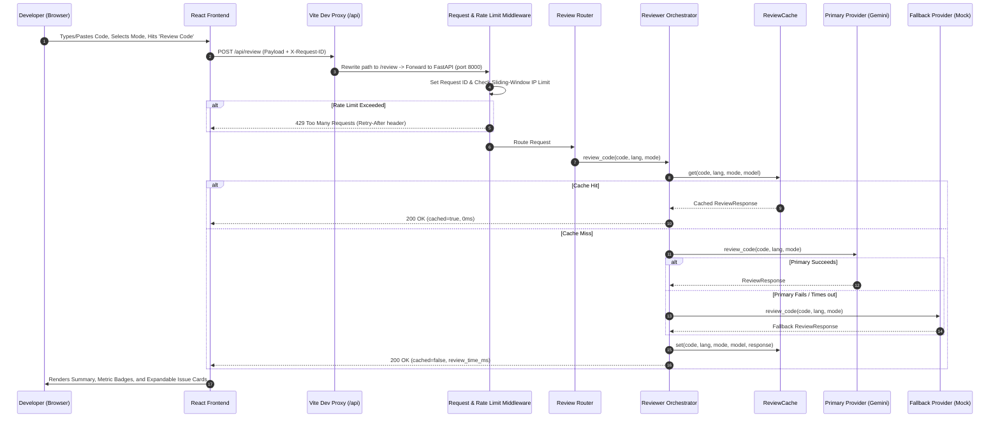

# System Architecture Document
## AI Code Review System

**Version:** 1.0.0  
**Date:** 2026-09-20  
**Status:** Full-Stack v1.0.0 Complete (Backend & Frontend Production Ready)  

---

## 1. Architecture Overview

The system follows a modern, **async-native full-stack architecture** with built-in caching, rate limiting, multi-provider resilience, and a rich, interactive React 19 web interface:

```text
┌─────────────────────────────────┐     HTTP / REST (JSON)     ┌────────────────────────────────────────────────────────┐     API Call     ┌──────────────────┐
│         React 19 Frontend       │  ──────────────────────►  │                    FastAPI Backend                     │  ────────────►  │   Primary AI     │
│   (Vite 8 + Monaco Editor +     │                           │                                                        │                 │ (Google Gemini)  │
│      Tailwind CSS UI)           │  ◄──────────────────────  │  [RateLimiter] ──► [Cache (SHA-256)] ──► [Orchestrator] │  ◄────────────  └──────────────────┘
│   [Vite Proxy /api -> Backend]  │     X-Request-ID + JSON   │                                                        │                          │ (Fallback)
└─────────────────────────────────┘                           └────────────────────────────────────────────────────────┘                          ▼
                                                                                                                           ┌──────────────────┐
                                                                                                                           │   Secondary AI   │
                                                                                                                           │ (OpenAI / Mock)  │
                                                                                                                           └──────────────────┘
```

---

## 2. Technology Stack

### Frontend Stack

| Layer | Technology | Role & Justification |
|---|---|---|
| **UI Library** | React 19 + TypeScript | Component-driven, type-safe architecture with high performance |
| **Bundler / Build Tool** | Vite 8 | Ultra-fast HMR and optimized ES modules build pipeline |
| **Code Editor** | Monaco Editor (`@monaco-editor/react`) | VS Code-grade code editing with syntax highlighting, line numbers, and theme support |
| **Styling** | Tailwind CSS & PostCSS | Responsive, accessible utility-first design matching dark theme design tokens |
| **HTTP Client** | Axios | Custom interceptors for `X-Request-ID` tracing, error normalization, and exponential backoff retry |
| **Icons** | Lucide React | Clean, scalable UI icons |
| **Testing** | Vitest + React Testing Library + jsdom | 82 comprehensive unit and component test cases |

### Backend Stack

| Layer | Technology | Role & Justification |
|---|---|---|
| **API Framework** | Python 3.10+ & FastAPI | Async-first, high throughput, automatic OpenAPI documentation, Pydantic validation |
| **Data Validation** | Pydantic v2 & Pydantic-Settings | Strict contract validation, type safety, environment configuration |
| **Server** | Uvicorn (ASGI) | Async event-loop worker server |
| **HTTP Client** | HTTPX (Async) | Non-blocking async client for OpenAI and OpenRouter endpoints |
| **AI Providers** | Google GenAI SDK (`google-genai`) | Primary LLM integration (`gemini-2.0-flash` / `gemini-1.5-flash`) |
| **Fallback AI** | OpenAI / OpenRouter & Mock | Automatic failover when primary provider is unavailable |
| **Cache** | In-Memory TTL LRU (`hashlib` SHA-256) | Zero-latency deduplication for repeated identical reviews |
| **Rate Limiter** | Sliding-Window IP Limiter | Protects API from denial-of-service and quota exhaustion (HTTP 429) |
| **Logging & Tracing** | JSON Structured Logger + ContextVars | Single-line JSON logs with `X-Request-ID` tracing across requests |
| **Testing** | Pytest + AnyIO | 100% route, provider, cache, and exception test coverage (32 tests) |

---

## 3. System Components

### 3.1 Component Diagram



### 3.2 Component Responsibilities

| Component | Responsibility |
|---|---|
| **Header** | Displays brand identity, dynamic backend health connectivity pill, and dark theme support. |
| **Editor Panel** | Houses Monaco Editor, language picker (12 languages), review mode selector (4 modes), and keyboard shortcut handler (`Ctrl+Enter` / `Cmd+Enter`). |
| **Results Panel** | Visualizes summary metadata (lines reviewed, execution time, provider, cache indicator), issue counts by severity, and interactive expandable issue cards. |
| **API Client (`api.ts`)** | Handles `/api` requests, automatic request ID injection, error normalization into `ApiError`, and exponential retry strategy. |
| **RequestIdMiddleware** | Generates or propagates `X-Request-ID` via contextvars for distributed tracing. |
| **RateLimitMiddleware** | Tracks sliding-window request volume per IP; raises `RateLimitExceededError` (429). |
| **Health Router** | `GET /health` diagnostic checks: provider state, model name, cache size, supported modes & languages. |
| **Review Router** | `POST /review` endpoint enforcing input validation and returning rich `ReviewResponse`. |
| **Reviewer Orchestrator** | Coordinates cache lookup, prompt construction, primary provider invocation, and fallback cascading. |
| **ReviewCache** | Generates SHA-256 keys from `(code, language, mode, model)` and enforces TTL expiration & LRU capacity. |
| **Prompt Builder** | Wraps code in `<user_code>` XML boundary tags, applies injection guardrails, and appends mode-specific rules. |
| **Exception Handlers** | Maps domain exceptions (`ReviewTimeoutError`, `RateLimitExceededError`, `ProviderError`, `ProviderUnavailableError`) to semantic HTTP status codes. |

---

## 4. Detailed Full-Stack Directory Structure

```text
ai-review-system/
├── backend/
│   ├── config.py                   # Pydantic BaseSettings (keys, timeouts, cache TTL, rate limits)
│   ├── exceptions.py               # Custom domain exceptions & FastAPI exception handlers
│   ├── main.py                     # App factory, middlewares, exception handlers, and routing
│   ├── models.py                   # Enums, CodeRequest, ReviewResponse, ReviewMetadata, HealthResponse
│   ├── requirements.txt            # Pinned dependencies
│   ├── routes/
│   │   ├── __init__.py
│   │   ├── health.py               # GET /health diagnostics
│   │   └── review.py               # POST /review endpoint
│   ├── services/
│   │   ├── __init__.py
│   │   ├── cache.py                # In-memory TTL SHA-256 review cache (LRU eviction)
│   │   ├── rate_limiter.py         # Sliding-window IP rate limiter
│   │   ├── reviewer.py             # Orchestrator with cache lookup & fallback cascade
│   │   └── providers/
│   │       ├── __init__.py
│   │       ├── base.py             # Async BaseReviewProvider
│   │       ├── gemini.py           # Async Google GenAI provider
│   │       ├── openai_provider.py  # Async OpenAI / OpenRouter provider
│   │       └── mock.py             # Deterministic mock provider
│   └── utils/
│       ├── __init__.py
│       ├── logger.py               # Structured JSON logger with request context
│       └── prompt_builder.py       # Mode prompts with XML injection guardrails
│
├── frontend/
│   ├── src/
│   │   ├── components/             # Header, Editor, Results, IssueCard, Skeleton, etc.
│   │   ├── lib/                    # api.ts, constants.ts, types.ts
│   │   ├── test/                   # Unit and integration tests (82 tests)
│   │   ├── App.tsx                 # Main application view
│   │   ├── main.tsx                # React root bootstrap
│   │   └── index.css               # Tailwind CSS directives and custom scrollbars
│   ├── package.json                # Frontend scripts and dependencies
│   ├── tsconfig.json               # TypeScript application config
│   ├── tsconfig.node.json          # TypeScript node config
│   ├── vite.config.ts              # Vite 8 config with proxy rewrite & React deduplication
│   └── vitest.config.ts            # Dedicated Vitest test environment config
│
├── docs/
│   ├── ARCHITECTURE.md             # System architecture & component design
│   ├── DEVELOPMENT.md              # Implementation roadmap & progress
│   ├── PRD.md                      # Product requirements document
│   ├── SRS.md                      # Software requirements specification
│   ├── UI-UX.md                    # Interface & interaction design
│   └── superpowers/specs/          # Feature design specifications
│
├── test/                           # Backend test suite (32 tests)
│   ├── test_cache.py
│   ├── test_exceptions.py
│   ├── test_health.py
│   ├── test_integration.py
│   ├── test_prompt_builder.py
│   ├── test_rate_limiter.py
│   └── test_review.py
│
├── .env.example                    # Template for environment configuration
├── .gitignore                      # Git ignore rules
├── pyproject.toml                  # Pytest configuration
└── README.md                       # Project documentation
```

---

## 5. API Design & Contracts

### 5.1 Endpoints

| Method | Path | Description | Status Codes |
|---|---|---|---|
| `GET` | `/` | API status and root greeting | `200` |
| `GET` | `/health` | Diagnostics: provider, model, cache size, supported languages/modes | `200` |
| `POST` | `/review` | Submit code for asynchronous review | `200`, `408`, `422`, `429`, `502`, `503` |

### 5.2 Schema Contracts

#### Request: `CodeRequest`
```json
{
  "code": "def calculate_total(items):\n    return sum(item.price for item in items)",
  "language": "python",
  "mode": "performance"
}
```
- `code`: 1 to 15,000 characters, non-whitespace.
- `language`: `python`, `javascript`, `typescript`, `java`, `go`, `rust`, `cpp`, `c`, `csharp`, `php`, `ruby`, `kotlin`.
- `mode`: `comprehensive`, `security`, `performance`, `style`.

#### Response: `ReviewResponse`
```json
{
  "summary": "Code is clean and utilizes generator expressions efficiently.",
  "issues": [],
  "metadata": {
    "language": "python",
    "mode": "performance",
    "lines_reviewed": 2,
    "review_time_ms": 12,
    "provider": "mock",
    "model": "mock-deterministic",
    "cached": false,
    "request_id": "93b16952-1678-4389-9cb1-96d5a109a25b"
  }
}
```

---

## 6. End-to-End Sequence Flow



---

## 7. Security Architecture

| Vector | Defense Implementation |
|---|---|
| **Prompt Injection** | Code wrapped inside `<user_code>` XML boundary tags with explicit system instructions to treat content strictly as inert data. |
| **Rate Abuse / DoS** | Sliding-window client IP limiter returning HTTP 429 with `Retry-After`. |
| **Payload Bloat** | Pydantic validation strictly caps submissions at 15,000 characters and rejects whitespace-only inputs; Frontend enforces real-time character counting. |
| **Secret Management** | API credentials configured through `.env` via `pydantic-settings`, excluded from git. |
| **Code Execution** | Code is strictly treated as string data and never dynamically evaluated on the host system. |
| **Tracing & Auditing** | `X-Request-ID` attached to all logs, Axios requests, and HTTP response headers for full auditability. |
| **CORS Policy** | Restricted origin communication ensuring safe browser interaction. |

---

## 8. Resilience & Fallback Strategy

The system employs a multi-tiered resilience architecture:
1. **Frontend Retry with Exponential Backoff:** Network hiccups or transient errors trigger automatic backoff retries via Axios interceptors.
2. **Primary $\rightarrow$ Fallback Cascade:** Configured via `REVIEW_PROVIDER` (e.g. `gemini`) and `FALLBACK_PROVIDER` (e.g. `mock` or `openai`). If upstream API connectivity fails or times out, the backend automatically fulfills the request using the secondary provider without client disruption.
3. **Deterministic Offline Provider:** The mock provider allows continuous development and integration testing without network access or consuming AI tokens.
4. **Vite Reverse Proxy Rewriting:** Seamless local development routing `/api/*` directly to `http://localhost:8000/*` with CORS prevention.
