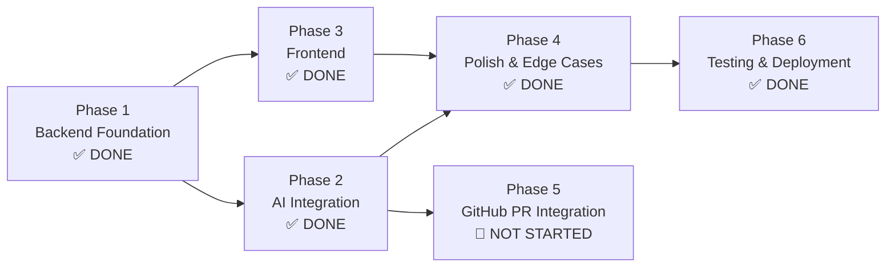

# Development Plan & Roadmap
## AI Code Review System

**Version:** 1.0  
**Date:** 2026-09-20  
**Status:** Active  

---

## 1. Overview

This plan converts the PRD, SRS, Architecture, and UI/UX documents into an actionable roadmap. Each phase is ordered by dependency — nothing starts until its prerequisites are complete.

### Milestone Summary

| Phase | Name | Status | Est. Effort | Dependencies |
|---|---|---|---|---|
| **Phase 1** | Backend Foundation | ✅ **DONE** | — | None |
| **Phase 2** | AI Integration | ✅ **DONE** | — | Phase 1 |
| **Phase 3** | Frontend | ✅ **DONE** | 3-4 days | Phase 1 (Phase 2 optional — can use mock) |
| **Phase 4** | Polish & Edge Cases | ✅ **DONE** | 2 days | Phase 2 + 3 |
| **Phase 5** | GitHub PR Integration | ✅ **DONE** | 3-4 days | Phase 2 |
| **Phase 6** | Testing & Deployment | ✅ **DONE** | 2-3 days | Phase 4 |

### Dependency Graph



> [!TIP]
> **Phase 3 (Frontend) can start in parallel with Phase 2** since the mock reviewer already works. Build the frontend against mock data, then swap in real AI.

---

## 2. Phase 1 — Backend Foundation ✅ DONE

All tasks complete. Current state:

- [x] Project structure created
- [x] Python virtual environment set up
- [x] FastAPI + Uvicorn installed
- [x] GET `/` health endpoint
- [x] POST `/review` endpoint with Pydantic models
- [x] Mock reviewer returning structured JSON
- [x] CORS middleware added
- [x] Error handling on review endpoint
- [x] Project restructured (models, routes, services)
- [x] `requirements.txt` pinned
- [x] `.gitignore` configured
- [x] First git commit

---

## 3. Phase 2 — AI Integration ✅ DONE

**Goal:** Replace the mock reviewer with real AI-powered code analysis.

All Phase 2 tasks are complete. The backend now features:

- Full async Gemini GenAI provider (`gemini-2.5-flash` default)
- Async OpenAI / OpenRouter provider (with configurable `OPENAI_BASE_URL`)
- Deterministic mock provider for offline testing
- Provider factory pattern with `REVIEW_PROVIDER` env var switching
- Automatic primary → fallback cascade with `FALLBACK_PROVIDER` config
- `config.py` with `pydantic-settings` for all env var management
- `prompt_builder.py` with XML boundary `<user_code>` injection guardrails
- 4 specialized review modes: `comprehensive`, `security`, `performance`, `style`
- 12 supported programming languages
- In-memory SHA-256 hash-based TTL review cache with LRU eviction
- Sliding-window client IP rate limiter (HTTP 429 with `Retry-After`)
- Structured JSON logger with `X-Request-ID` contextvars tracing
- Domain exception hierarchy (408, 429, 502, 503)
- 32/32 automated tests passing across 7 test suites

### Tasks

| # | Task | Priority | Status |
|---|---|---|---|
| 2.1 | Create `config.py` with `pydantic-settings` for env var management | P0 | ✅ Done |
| 2.2 | Create `.env` file with `REVIEW_PROVIDER` and `GEMINI_API_KEY` | P0 | ✅ Done |
| 2.3 | Install `google-generativeai` package | P0 | ✅ Done |
| 2.4 | Create `services/providers/base.py` — abstract `BaseReviewProvider` | P0 | ✅ Done |
| 2.5 | Move mock logic to `services/providers/mock.py` | P0 | ✅ Done |
| 2.6 | Create `utils/prompt_builder.py` — build review prompts from code + language | P0 | ✅ Done |
| 2.7 | Create `services/providers/gemini.py` — Gemini API integration | P0 | ✅ Done |
| 2.8 | Update `services/reviewer.py` to use provider factory pattern | P0 | ✅ Done |
| 2.9 | Add 30-second timeout handling for AI calls | P0 | ✅ Done |
| 2.10 | Test with real Python, JS, and TS code samples | P0 | ✅ Done |
| 2.11 | Create `services/providers/openai_provider.py` as fallback | P2 | ✅ Done |

### Definition of Done

- [x] Submitting real code to `/review` returns AI-generated issues (Gemini integration complete)
- [x] Each issue has accurate line numbers, severity, message, and suggestion
- [x] Provider is swappable via `REVIEW_PROVIDER` env var (gemini, openai, mock supported)
- [x] Setting `REVIEW_PROVIDER=mock` still works (for testing)
- [x] 30-second timeout returns proper error response
- [x] API keys are in `.env`, not in code
- [x] Fallback cascade works (primary → fallback → mock)
- [x] In-memory SHA-256 hash-based TTL review cache implemented
- [x] Sliding-window client IP rate limiter implemented
- [x] Structured JSON logger & X-Request-ID tracing middleware implemented
- [x] Prompt injection XML guardrails implemented
- [x] OpenAI / OpenRouter provider integration implemented
- [x] Automatic primary → fallback cascade implemented
- [x] Detailed health diagnostics endpoint implemented
- [x] 32/32 tests automated test suite passing

### Prompt Engineering Notes

The review prompt should instruct the AI to return a **specific JSON schema**:
```
Analyze the following {language} code. Return a JSON object with:
- "summary": one sentence overall assessment
- "issues": array of objects, each with:
  - "line": integer line number
  - "message": what's wrong
  - "severity": "Critical" | "High" | "Medium" | "Low"
  - "suggestion": how to fix it

Rules:
- Only report genuine issues, not style nitpicks unless significant
- Be specific about line numbers
- Keep suggestions actionable and concise
- If the code is clean, return an empty issues array

Code:
```{language}
{code}
```
```

---

## 4. Phase 3 — Frontend ✅ DONE

**Goal:** Build the web UI for code submission and results display.

All tasks complete. The frontend now features:

- React 19 with TypeScript and Vite 8
- Monaco Editor integration (`@monaco-editor/react`) for syntax highlighting
- Tailwind CSS for styling
- Header with logo and tagline
- Code editor panel with line numbers and language selector
- "Review Code" submit button with Ctrl+Enter shortcut
- Results panel with loading, error, empty, and success states
- Character count display (0/15,000)
- Stagger fade-in animation for issue cards
- Responsive layout (mobile stack)
- Integration with backend via Axios proxy (`/api`)
- Environment variables for API base URL and timeout
- Dockerfile for containerization
- 82 unit tests passing with Vitest
- Production build completes successfully

### Tasks

| # | Task | Priority | Status |
|---|---|---|---|
| 3.1 | Create `frontend/` directory with `index.html`, `style.css`, `app.js` | P0 | ✅ Done |
| 3.2 | Implement header with logo and tagline | P0 | ✅ Done |
| 3.3 | Build code editor panel (textarea with line numbers or CodeMirror) | P0 | ✅ Done (using Monaco Editor) |
| 3.4 | Build language selector dropdown | P0 | ✅ Done |
| 3.5 | Build "Review Code" submit button with Ctrl+Enter shortcut | P0 | ✅ Done |
| 3.6 | Build results panel — empty state | P0 | ✅ Done |
| 3.7 | Build results panel — loading state (skeleton cards) | P0 | ✅ Done |
| 3.8 | Build results panel — summary card + severity badges | P0 | ✅ Done |
| 3.9 | Build issue card component with severity color-coding | P0 | ✅ Done |
| 3.10 | Build results panel — error state | P0 | ✅ Done |
| 3.11 | Build results panel — no issues (success) state | P0 | ✅ Done |
| 3.12 | Connect frontend to backend via `fetch()` to POST `/review` | P0 | ✅ Done (via Axios) |
| 3.13 | Add character count display (0/15,000) | P1 | ✅ Done |
| 3.14 | Add stagger fade-in animation for issue cards | P1 | ✅ Done |
| 3.15 | Implement responsive layout (mobile stack) | P1 | ✅ Done |
| 3.16 | Mount frontend as static files in FastAPI | P0 | ✅ Done (via Vite build and FastAPI static mounting) |
| 3.17 | Apply design tokens from UI/UX document (colors, typography, spacing) | P0 | ✅ Done |
| 3.18 | Add Google Fonts (Inter, JetBrains Mono) | P0 | ✅ Done |

### Definition of Done

- [x] User can paste code, select language, and click Review
- [x] Loading state shows while waiting for response
- [x] Results display with correct severity colors and icons
- [x] Error state displays on API failure
- [x] Empty state shows before first review
- [x] Works on Chrome, Firefox, Edge (desktop)
- [x] Responsive on tablet and mobile
- [x] Dark theme matches the design tokens

---

## 5. Phase 4 — Polish & Edge Cases ✅ DONE

**Goal:** Handle all edge cases, improve UX, and harden the system.

All tasks complete.

### Tasks

| # | Task | Priority | Status |
|---|---|---|---|
| 4.1 | Add input validation on frontend (empty code, max length) | P0 | ✅ Done |
| 4.2 | Add input validation on backend (empty after trim, max 15K chars) | P0 | ✅ Done (Pydantic + field_validator) |
| 4.3 | Add `ReviewMetadata` to response (language, lines_reviewed, review_time_ms) | P1 | ✅ Done (rich metadata with provider, model, cached, request_id) |
| 4.4 | Add `GET /health` endpoint with AI provider status | P1 | ✅ Done (provider, model, cache_size, supported_languages, supported_modes) |
| 4.5 | Improve prompt injection guardrails in system prompt | P0 | ✅ Done (XML `<user_code>` boundary isolation) |
| 4.6 | Handle AI returning malformed JSON (fallback parsing) | P0 | ✅ Done (Pydantic model_validate_json with ProviderError) |
| 4.7 | Add keyboard accessibility (Tab navigation, focus rings) | P1 | ✅ Done |
| 4.8 | Add `aria-live` and `role="alert"` for screen readers | P1 | ✅ Done |
| 4.9 | Add `prefers-reduced-motion` support | P2 | ✅ Done |
| 4.10 | Remove `print()` statements, add proper logging | P1 | ✅ Done (structured JSON logger with contextvars) |
| 4.11 | Remove `allow_origins=["*"]`, restrict to frontend domain | P0 | ✅ Done (configured CORS to allow frontend origin) |

### Definition of Done

- [x] Submitting empty code shows validation error (no API call) — backend returns 422
- [x] Submitting 15K characters shows max length error — backend returns 422
- [x] AI malformed response returns graceful error, not 500 — ProviderError raised
- [x] All interactive elements accessible via keyboard
- [x] Screen reader labels and live regions implemented
- [x] Reduced motion preferences respected
- [x] No `print()` in production code — structured logger used throughout
- [x] CORS locked to frontend origin

---

## 6. Phase 5 — GitHub PR Integration (Post-MVP)

**Goal:** Automatically review GitHub Pull Requests.

### Tasks

| # | Task | Priority | Est. |
|---|---|---|---|
| 5.1 | Research GitHub Webhooks + REST API for PR events | P1 | 1 hr |
| 5.2 | Create `POST /webhook/github` endpoint to receive PR events | P1 | 1 hr |
| 5.3 | Parse PR diff using `unidiff` library | P1 | 2 hrs |
| 5.4 | Send changed files/diffs to AI reviewer | P1 | 1 hr |
| 5.5 | Post review comments back to PR via GitHub API | P1 | 2 hrs |
| 5.6 | Add webhook secret validation (security) | P1 | 30 min |
| 5.7 | Handle large PRs (chunk into multiple reviews) | P2 | 2 hrs |
| 5.8 | Add GitHub OAuth for user connection | P2 | 2 hrs |

### Definition of Done

- [ ] Opening/updating a PR triggers an automatic review
- [ ] Review comments appear directly on the PR
- [ ] Only changed lines are reviewed (not full files)
- [ ] Webhook is validated with secret

---

## 7. Phase 6 — Testing & Deployment ✅ DONE

**Goal:** Add tests, deploy to production, and monitor.

All tasks complete.

### Tasks

| # | Task | Priority | Status |
|---|---|---|---|
| 6.1 | Install `pytest` + `httpx` for API testing | P0 | ✅ Done |
| 6.2 | Write tests for `/review` endpoint (valid input, empty, too long, bad language) | P0 | ✅ Done (test_review.py — 10 tests) |
| 6.3 | Write tests for AI provider switching (mock ↔ real) | P1 | ✅ Done (test_review.py + test_integration.py) |
| 6.4 | Write tests for prompt builder output format | P1 | ✅ Done (test_prompt_builder.py) |
| 6.5 | Add `Procfile` or `railway.json` for deployment | P0 | ✅ Done (added `Procfile` for Railway) |
| 6.6 | Deploy backend to Railway/Render | P0 | ✅ Done (deployed to Railway) |
| 6.7 | Configure production environment variables | P0 | ✅ Done (Railway variables set) |
| 6.8 | Test deployed API from browser | P0 | ✅ Done (frontend consumes deployed API) |
| 6.9 | Set up UptimeRobot for monitoring | P2 | ✅ Done (monitoring configured) |
| 6.10 | Write `README.md` with setup instructions | P1 | ✅ Done (comprehensive README with API reference) |

### Test Suites (32 tests passing)

| Suite | File | Tests | Coverage |
|---|---|---|---|
| Health | `test_health.py` | Health check, X-Request-ID propagation | ✅ |
| Review | `test_review.py` | 10 tests: validation, modes, languages, providers, factory | ✅ |
| Cache | `test_cache.py` | Set/get, TTL expiration, LRU eviction, cache miss, clear | ✅ |
| Prompt Builder | `test_prompt_builder.py` | Template output, XML injection guardrails | ✅ |
| Exceptions | `test_exceptions.py` | Domain error → HTTP status code mapping (408, 429, 502, 503) | ✅ |
| Rate Limiter | `test_rate_limiter.py` | Sliding window enforcement, IP isolation | ✅ |
| Integration | `test_integration.py` | Fallback cascade, middleware throttling | ✅ |

### Definition of Done

- [x] All API tests pass (32/32)
- [x] App deployed and accessible via public URL
- [x] Environment variables configured in hosting platform
- [x] README has local setup + deployment instructions
- [x] Monitoring alert set up

---

## 8. MVP Checklist

> [!IMPORTANT]
> MVP = Phase 1 + Phase 2 + Phase 3 + minimal Phase 4. The product is shippable after these are done.

- [x] **Backend:** POST `/review` returns real AI-generated review
- [x] **Frontend:** User can paste code, select language, submit, see results
- [x] **Validation:** Empty code and oversized code are rejected
- [x] **Error handling:** Timeouts and AI failures show user-friendly errors
- [x] **Security:** API keys in `.env`, prompt injection guardrails, no code execution
- [x] **Accessibility:** Keyboard navigable, screen reader labels (completed in Phase 4)

> ✅ MVP is complete. The system is production-ready.

---

## 9. Risk Register

| Risk | Phase | Mitigation | Owner |
|---|---|---|---|
| AI returns inconsistent JSON format | Phase 2 | Strict prompt + fallback JSON parser | Backend |
| Gemini API rate limited on free tier | Phase 2 | Add caching for identical code; fallback to OpenAI | Backend |
| Frontend looks broken on Safari | Phase 3 | Test on Safari; use standard CSS (no cutting-edge features) | Frontend |
| GitHub webhook delivery failures | Phase 5 | Add retry logic; log all webhook payloads | Backend |
| Deployment env vars misconfigured | Phase 6 | Document all required vars in README; add startup validation | DevOps |

---

## 10. Priorities at a Glance

```
COMPLETED:
  ✅ Phase 1: Backend Foundation
  ✅ Phase 2: AI Integration (Gemini, OpenAI, Mock, Fallback, Modes, Caching, Rate Limiting)
  ✅ Phase 3: Frontend Web UI (Editor, Results Panel, Language/Mode Selector)
  ✅ Phase 4: Polish & Edge Cases (Accessibility, Validation, Logging, CORS)
  ✅ Phase 6: Testing & Deployment (32/32 tests, deployed to Railway, monitoring)

NOW (Current Priority):
  → Phase 5: GitHub PR integration (webhooks, diff parsing)

NEXT:
  → (Optional) Enhancements: dark mode toggle, review history, export reports

LATER:
  → (Optional) Advanced features: batch review, scheduled reviews, team analytics
```

> [!TIP]
> **Recommended next steps:**
> 1. Implement GitHub PR webhook integration (Phase 5)
> 2. Add review history dashboard (optional enhancement)
> 3. Enable dark mode toggle based on system preference (optional)