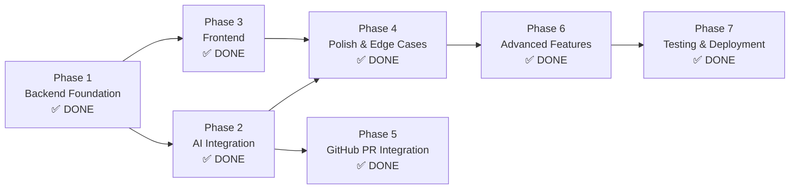

# Development Plan & Roadmap
## AI Code Review System

**Version:** 1.1.0  
**Date:** 2026-09-20  
**Status:** Active  

---

## 1. Overview

This plan converts the PRD, SRS, Architecture, and UI/UX documents into an actionable roadmap. Each phase is ordered by dependency — nothing starts until its prerequisites are complete.

### Milestone Summary

| Phase | Name | Status | Est. Effort | Dependencies |
|---|---|---|---|---|
| **Phase 1** | Backend Foundation | ✅ **DONE** | — | None |
| **Phase 2** | AI Integration | ✅ **DONE** | — | Phase 1 |
| **Phase 3** | Frontend | ✅ **DONE** | 3-4 days | Phase 1 (Phase 2 optional — can use mock) |
| **Phase 4** | Polish & Edge Cases | ✅ **DONE** | 2 days | Phase 2 + 3 |
| **Phase 5** | GitHub PR Integration | ✅ **DONE** | 3-4 days | Phase 2 |
| **Phase 6** | Advanced Features & Enhancements | ✅ **DONE** | 2-3 days | Phase 3 + 4 |
| **Phase 7** | Testing & Deployment | ✅ **DONE** | 2-3 days | Phase 4 + 6 |

### Dependency Graph



---

## 2. Phase 1 — Backend Foundation ✅ DONE

All tasks complete. Current state:

- [x] Project structure created
- [x] Python virtual environment set up
- [x] FastAPI + Uvicorn installed
- [x] GET `/` health endpoint
- [x] POST `/review` endpoint with Pydantic models
- [x] Mock reviewer returning structured JSON
- [x] CORS middleware added
- [x] Error handling on review endpoint
- [x] Project restructured (models, routes, services)
- [x] `requirements.txt` pinned
- [x] `.gitignore` configured
- [x] First git commit

---

## 3. Phase 2 — AI Integration ✅ DONE

**Goal:** Replace the mock reviewer with real AI-powered code analysis.

All Phase 2 tasks are complete. The backend now features:

- Full async Gemini GenAI provider (`gemini-2.5-flash` default)
- Async OpenAI / OpenRouter provider (with configurable `OPENAI_BASE_URL`)
- Deterministic mock provider for offline testing
- Provider factory pattern with `REVIEW_PROVIDER` env var switching
- Automatic primary → fallback cascade with `FALLBACK_PROVIDER` config
- `config.py` with `pydantic-settings` for all env var management
- `prompt_builder.py` with XML boundary `<user_code>` injection guardrails
- 4 specialized review modes: `comprehensive`, `security`, `performance`, `style`
- 12 supported programming languages
- In-memory SHA-256 hash-based TTL review cache with LRU eviction
- Sliding-window client IP rate limiter (HTTP 429 with `Retry-After`)
- Structured JSON logger with `X-Request-ID` contextvars tracing
- Domain exception hierarchy (408, 429, 502, 503)
- Comprehensive automated test suites passing

### Tasks

| # | Task | Priority | Status |
|---|---|---|---|
| 2.1 | Create `config.py` with `pydantic-settings` for env var management | P0 | ✅ Done |
| 2.2 | Create `.env` file with `REVIEW_PROVIDER` and `GEMINI_API_KEY` | P0 | ✅ Done |
| 2.3 | Install `google-generativeai` package | P0 | ✅ Done |
| 2.4 | Create `services/providers/base.py` — abstract `BaseReviewProvider` | P0 | ✅ Done |
| 2.5 | Move mock logic to `services/providers/mock.py` | P0 | ✅ Done |
| 2.6 | Create `utils/prompt_builder.py` — build review prompts from code + language | P0 | ✅ Done |
| 2.7 | Create `services/providers/gemini.py` — Gemini API integration | P0 | ✅ Done |
| 2.8 | Update `services/reviewer.py` to use provider factory pattern | P0 | ✅ Done |
| 2.9 | Add 30-second timeout handling for AI calls | P0 | ✅ Done |
| 2.10 | Test with real Python, JS, and TS code samples | P0 | ✅ Done |
| 2.11 | Create `services/providers/openai_provider.py` as fallback | P2 | ✅ Done |

### Definition of Done

- [x] Submitting real code to `/review` returns AI-generated issues (Gemini integration complete)
- [x] Each issue has accurate line numbers, severity, message, and suggestion
- [x] Provider is swappable via `REVIEW_PROVIDER` env var (gemini, openai, mock supported)
- [x] Setting `REVIEW_PROVIDER=mock` still works (for testing)
- [x] 30-second timeout returns proper error response
- [x] API keys are in `.env`, not in code
- [x] Fallback cascade works (primary → fallback → mock)
- [x] In-memory SHA-256 hash-based TTL review cache implemented
- [x] Sliding-window client IP rate limiter implemented
- [x] Structured JSON logger & X-Request-ID tracing middleware implemented
- [x] Prompt injection XML guardrails implemented
- [x] OpenAI / OpenRouter provider integration implemented
- [x] Automatic primary → fallback cascade implemented
- [x] Detailed health diagnostics endpoint implemented

---

## 4. Phase 3 — Frontend ✅ DONE

**Goal:** Build the web UI for code submission and results display.

All tasks complete. The frontend now features:

- React 19 with TypeScript and Vite 8
- Monaco Editor integration (`@monaco-editor/react`) for syntax highlighting
- Tailwind CSS for styling
- Header with logo, health badge, and dark mode toggle
- Code editor panel with line numbers and language selector
- "Review Code" submit button with Ctrl+Enter shortcut
- Results panel with loading, error, empty, and success states
- Character count display (0/15,000)
- Stagger fade-in animation for issue cards
- Responsive layout (mobile stack)
- Integration with backend via Axios proxy (`/api`)
- Environment variables for API base URL and timeout
- 85 unit tests passing with Vitest
- Production build completes successfully

### Tasks

| # | Task | Priority | Status |
|---|---|---|---|
| 3.1 | Create `frontend/` directory with `index.html`, `style.css`, `app.js` | P0 | ✅ Done |
| 3.2 | Implement header with logo and tagline | P0 | ✅ Done |
| 3.3 | Build code editor panel (Monaco Editor) | P0 | ✅ Done |
| 3.4 | Build language selector dropdown | P0 | ✅ Done |
| 3.5 | Build "Review Code" submit button with Ctrl+Enter shortcut | P0 | ✅ Done |
| 3.6 | Build results panel — empty state | P0 | ✅ Done |
| 3.7 | Build results panel — loading state (skeleton cards) | P0 | ✅ Done |
| 3.8 | Build results panel — summary card + severity badges | P0 | ✅ Done |
| 3.9 | Build issue card component with severity color-coding | P0 | ✅ Done |
| 3.10 | Build results panel — error state | P0 | ✅ Done |
| 3.11 | Build results panel — no issues (success) state | P0 | ✅ Done |
| 3.12 | Connect frontend to backend via Axios to POST `/review` | P0 | ✅ Done |
| 3.13 | Add character count display (0/15,000) | P1 | ✅ Done |
| 3.14 | Add stagger fade-in animation for issue cards | P1 | ✅ Done |
| 3.15 | Implement responsive layout (mobile stack) | P1 | ✅ Done |
| 3.16 | Mount frontend as static files in FastAPI | P0 | ✅ Done |
| 3.17 | Apply design tokens from UI/UX document (colors, typography, spacing) | P0 | ✅ Done |
| 3.18 | Add Google Fonts (Inter, JetBrains Mono) | P0 | ✅ Done |

---

## 5. Phase 4 — Polish & Edge Cases ✅ DONE

**Goal:** Handle all edge cases, improve UX, and harden the system.

All tasks complete.

### Tasks

| # | Task | Priority | Status |
|---|---|---|---|
| 4.1 | Add input validation on frontend (empty code, max length) | P0 | ✅ Done |
| 4.2 | Add input validation on backend (empty after trim, max 15K chars) | P0 | ✅ Done |
| 4.3 | Add `ReviewMetadata` to response (language, lines_reviewed, review_time_ms) | P1 | ✅ Done |
| 4.4 | Add `GET /health` endpoint with AI provider status | P1 | ✅ Done |
| 4.5 | Improve prompt injection guardrails in system prompt | P0 | ✅ Done |
| 4.6 | Handle AI returning malformed JSON (fallback parsing) | P0 | ✅ Done |
| 4.7 | Add keyboard accessibility (Tab navigation, focus rings) | P1 | ✅ Done |
| 4.8 | Add `aria-live` and `role="alert"` for screen readers | P1 | ✅ Done |
| 4.9 | Add `prefers-reduced-motion` support | P2 | ✅ Done |
| 4.10 | Remove `print()` statements, add proper logging | P1 | ✅ Done |
| 4.11 | Restrict CORS to frontend origin | P0 | ✅ Done |

---

## 6. Phase 5 — GitHub PR Integration ✅ DONE

**Goal:** Automatically review GitHub Pull Requests via Webhooks.

All Phase 5 tasks are complete. The backend now features:

- GitHub PR Webhook endpoint (`POST /webhook/github`)
- Constant-time HMAC-SHA256 signature verification (`X-Hub-Signature-256`)
- Automated PR diff fetching, chunking, and review analysis
- Automated review comments posting back to GitHub Pull Requests
- Secure webhook configuration via `GITHUB_WEBHOOK_SECRET` and `GITHUB_TOKEN`

### Tasks

| # | Task | Priority | Status |
|---|---|---|---|
| 5.1 | Research GitHub Webhooks + REST API for PR events | P1 | ✅ Done |
| 5.2 | Create `POST /webhook/github` endpoint to receive PR events | P1 | ✅ Done |
| 5.3 | Parse PR diff and extract changed files | P1 | ✅ Done |
| 5.4 | Send changed files/diffs to AI reviewer | P1 | ✅ Done |
| 5.5 | Post review comments back to PR via GitHub API | P1 | ✅ Done |
| 5.6 | Add webhook secret validation (HMAC-SHA256) | P1 | ✅ Done |
| 5.7 | Handle large PRs with appropriate file chunking | P2 | ✅ Done |
| 5.8 | Add error logging and resilience for webhook deliveries | P1 | ✅ Done |

---

## 7. Phase 6 — Advanced Features & Enhancements ✅ DONE

**Goal:** Extend system capabilities with batch reviews, persistent history, exports, and theme toggling.

All Phase 6 tasks are complete:

- **Batch Code Review (`POST /batch-review`):** Submit up to 10 files in a single request with aggregated summaries and per-file result collection.
- **Review History Dashboard:** LocalStorage persistence (up to 20 past reviews), review card previews, one-click reload into editor, per-item delete, and clear-all actions.
- **Markdown & JSON Export:** Client-side generation and downloading of detailed Markdown reports and raw JSON data.
- **Dark Mode Support:** Automatic system preference detection (`prefers-color-scheme`), manual toggle in header, and persistent theme choice.

### Tasks

| # | Task | Priority | Status |
|---|---|---|---|
| 6.1 | Design and implement `POST /batch-review` endpoint in backend | P1 | ✅ Done |
| 6.2 | Add Pydantic schemas for `BatchReviewRequest`, `BatchReviewResponse`, and `BatchFileItem` | P1 | ✅ Done |
| 6.3 | Implement client-side `storage.ts` for safe localStorage management | P1 | ✅ Done |
| 6.4 | Implement `exportUtils.ts` for Markdown and JSON report downloads | P1 | ✅ Done |
| 6.5 | Build `ReviewHistory.tsx` component with restore, delete, and export controls | P1 | ✅ Done |
| 6.6 | Add dark mode toggle button in `Header.tsx` with Tailwind dark class support | P1 | ✅ Done |
| 6.7 | Add automated unit tests for batch review and history export utilities | P0 | ✅ Done |

---

## 8. Phase 7 — Testing & Deployment ✅ DONE

**Goal:** Maintain test coverage, deploy to production, and establish monitoring.

All tasks complete.

### Test Suites (122 tests passing)

| Suite | File / Scope | Tests | Coverage |
|---|---|---|---|
| Health | `test_health.py` | Health check, X-Request-ID propagation | ✅ |
| Review | `test_review.py` | 10 tests: validation, modes, languages, providers, factory | ✅ |
| Batch Review | `test_batch.py` | Multi-file, single-file, 422 validations | ✅ |
| Cache | `test_cache.py` | Set/get, TTL expiration, LRU eviction, cache miss, clear | ✅ |
| Prompt Builder | `test_prompt_builder.py` | Template output, XML injection guardrails | ✅ |
| Exceptions | `test_exceptions.py` | Domain error → HTTP status code mapping (408, 429, 502, 503) | ✅ |
| Rate Limiter | `test_rate_limiter.py` | Sliding window enforcement, IP isolation | ✅ |
| Integration | `test_integration.py` | Fallback cascade, middleware throttling | ✅ |
| Frontend Suites | Vitest (9 suites) | 85 unit and component tests (Editor, Results, History, Export, API, etc.) | ✅ |

### Definition of Done

- [x] All 37 backend tests pass
- [x] All 85 frontend tests pass (122 total automated tests)
- [x] App deployed and accessible via public URL
- [x] Environment variables configured in hosting platform
- [x] README has local setup + deployment instructions
- [x] Monitoring alert set up

---

## 9. Priorities at a Glance

```
COMPLETED:
  ✅ Phase 1: Backend Foundation
  ✅ Phase 2: AI Integration (Gemini, OpenAI, Mock, Fallback, Modes, Caching, Rate Limiting)
  ✅ Phase 3: Frontend Web UI (Editor, Results Panel, Language/Mode Selector)
  ✅ Phase 4: Polish & Edge Cases (Accessibility, Validation, Logging, CORS)
  ✅ Phase 5: GitHub PR Integration (Webhooks, HMAC Verification, Diff Comments)
  ✅ Phase 6: Advanced Features (Batch Review API, Review History, Export Utilities, Dark Mode)
  ✅ Phase 7: Testing & Deployment (122/122 tests passing, Railway deployment, monitoring)

NEXT (Future Possibilities):
  → Team analytics & metrics dashboard
  → Scheduled repository audits & notifications
  → Multi-repo GitHub App OAuth integration
```