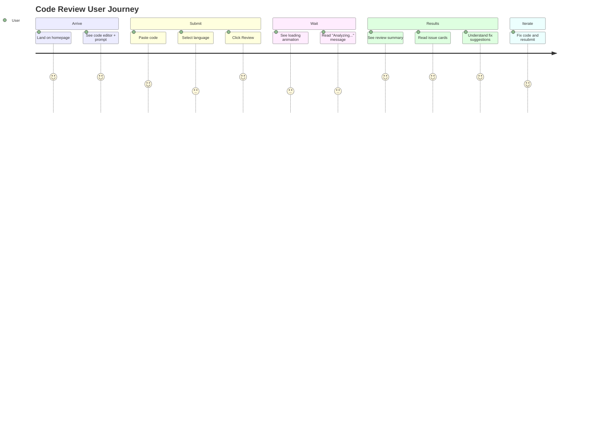

# UI/UX Design Document
## AI Code Review System

**Version:** 1.0  
**Date:** 2026-09-14  
**Status:** Draft  

---

## 1. Design Principles

| Principle | Description |
|---|---|
| **Clarity over cleverness** | Every element serves a purpose. No decorative clutter. |
| **Speed perception** | Skeleton loaders and animations make the app feel fast even during AI processing. |
| **Code-first** | The code editor is the hero — it gets the most screen real estate. |
| **Actionable feedback** | Every issue shows what's wrong AND how to fix it. No vague warnings. |
| **Dark by default** | Developers live in dark themes. The UI should feel like their IDE. |

---

## 2. User Journey



---

## 3. Information Architecture

The MVP is a **single-page application** with no navigation. Everything happens on one screen.

```
┌──────────────────────────────────────────────────────┐
│  Header (Logo + Title)                               │
├────────────────────────┬─────────────────────────────┤
│                        │                             │
│   Code Input Panel     │    Results Panel            │
│                        │                             │
│   ┌──────────────┐     │    ┌─────────────────┐      │
│   │ Language      │     │    │ Summary Card    │      │
│   │ Dropdown      │     │    └─────────────────┘      │
│   └──────────────┘     │    ┌─────────────────┐      │
│   ┌──────────────┐     │    │ Issue Card #1   │      │
│   │              │     │    └─────────────────┘      │
│   │  Code        │     │    ┌─────────────────┐      │
│   │  Editor      │     │    │ Issue Card #2   │      │
│   │              │     │    └─────────────────┘      │
│   │              │     │    ┌─────────────────┐      │
│   └──────────────┘     │    │ Issue Card #3   │      │
│                        │    └─────────────────┘      │
│   [Review Code ►]      │                             │
│                        │                             │
├────────────────────────┴─────────────────────────────┤
│  Footer (minimal)                                    │
└──────────────────────────────────────────────────────┘
```

**On mobile:** Panels stack vertically (editor on top, results below).

---

## 4. Screen: Main Review Page

### 4.1 Header

| Element | Spec |
|---|---|
| Logo | Simple icon or text mark — "AI Reviewer" |
| Tagline | "AI-powered code review in seconds" |
| Background | Subtle gradient or solid dark |
| Height | 64px |

### 4.2 Code Input Panel (Left)

| Element | Spec |
|---|---|
| **Language Selector** | Dropdown: Python (default), JavaScript, TypeScript |
| **Code Editor** | Monospace textarea with line numbers, min-height 400px |
| **Placeholder Text** | "Paste your code here..." in muted color |
| **Character Count** | "0 / 10,000" shown below editor, turns red near limit |
| **Review Button** | Primary button, full-width below editor: "Review Code ▶" |
| **Keyboard Shortcut** | Ctrl+Enter to submit (tooltip on button) |

### 4.3 Results Panel (Right)

#### State: Empty (Initial)
- Light illustration or icon
- Text: "Paste your code and click Review to get started"
- Muted color, centered

#### State: Loading
- Pulsing skeleton cards (3 placeholder cards)
- Text: "Analyzing your code..." with animated dots
- Estimated time: "Usually takes 5-10 seconds"

#### State: Results
| Element | Spec |
|---|---|
| **Summary Card** | Top card with review summary text, subtle border |
| **Severity Badges** | Pill badges showing count per severity: `🔴 2 Critical  🟠 1 High  🟡 3 Medium  🔵 1 Low` |
| **Issue Cards** | Stacked vertically, one per issue |

#### State: No Issues Found
- Success icon (green checkmark)
- Text: "No issues found! Your code looks great. 🎉"

#### State: Error
- Error icon (red warning)
- Text: error message from API
- "Try Again" button

### 4.4 Issue Card Component

```
┌──────────────────────────────────────────┐
│  🔴 Critical          Line 5            │
│──────────────────────────────────────────│
│  Potential SQL Injection vulnerability   │
│                                          │
│  💡 Suggestion:                          │
│  Use parameterized queries instead of    │
│  f-strings for database operations.      │
└──────────────────────────────────────────┘
```

| Element | Spec |
|---|---|
| **Severity Badge** | Color-coded pill (see colors below) |
| **Line Number** | Right-aligned, monospace font |
| **Message** | Primary text, 14-16px, high contrast |
| **Suggestion** | Secondary section with lightbulb icon, slightly muted |
| **Border Left** | 4px solid border matching severity color |

---

## 5. Component Specifications

### 5.1 Buttons

| Variant | Background | Text | Border | Usage |
|---|---|---|---|---|
| **Primary** | `#6C63FF` (indigo) | White | None | Review Code |
| **Primary Hover** | `#5A52E0` | White | None | — |
| **Primary Disabled** | `#3D3A5C` | `#888` | None | During loading |
| **Secondary** | Transparent | `#6C63FF` | 1px `#6C63FF` | Try Again |

### 5.2 Language Selector

- Dark dropdown matching the editor background
- Options: Python, JavaScript, TypeScript
- Icon prefix showing language logo (optional)
- Default selection: Python

### 5.3 Code Editor

- Monospace font: `JetBrains Mono` or `Fira Code` (fallback: `monospace`)
- Background: `#1E1E2E` (deep dark)
- Text color: `#CDD6F4`
- Line numbers: `#585B70` (muted)
- Border: 1px `#313244`, rounded 8px
- Padding: 16px
- Min height: 400px, resizable vertically

---

## 6. Interaction Patterns

### 6.1 Submit Flow
1. User clicks "Review Code" → button shows spinner + "Reviewing..."
2. Button becomes disabled (prevent double-submit)
3. Results panel shows skeleton loader
4. On success → skeleton replaced with real results (fade in)
5. On error → skeleton replaced with error state
6. Button re-enables

### 6.2 Keyboard Shortcuts

| Shortcut | Action |
|---|---|
| `Ctrl + Enter` | Submit code for review |
| `Ctrl + A` | Select all code in editor |
| `Escape` | Clear results panel |

### 6.3 Micro-Animations

| Element | Animation |
|---|---|
| Issue cards | Stagger fade-in (each card 50ms after previous) |
| Severity badges | Count up from 0 on results load |
| Review button | Subtle pulse on hover |
| Loading dots | Three dots with sequential opacity animation |
| Error shake | Gentle horizontal shake on error state |

---

## 7. Responsive Behavior

| Breakpoint | Layout |
|---|---|
| **≥ 1024px** (Desktop) | Two-column: editor left (50%), results right (50%) |
| **768–1023px** (Tablet) | Two-column: editor left (45%), results right (55%) |
| **< 768px** (Mobile) | Single column: editor on top, results below |

### Mobile Adjustments
- Code editor min-height reduced to 250px
- Review button full-width, sticky at bottom of editor
- Issue cards use full width
- Header collapses to single line

---

## 8. Accessibility (WCAG 2.1 AA)

| Requirement | Implementation |
|---|---|
| **Color contrast** | All text meets 4.5:1 ratio against backgrounds |
| **Severity not color-only** | Severity uses text label + color (not just color) |
| **Keyboard navigation** | All interactive elements reachable via Tab |
| **Focus indicators** | Visible focus ring on all interactive elements |
| **Screen reader labels** | `aria-label` on buttons, `role` on dynamic regions |
| **Loading state** | `aria-live="polite"` on results panel for screen reader updates |
| **Error messages** | `role="alert"` on error displays |
| **Motion** | Respects `prefers-reduced-motion` — disables animations |

---

## 9. Design Tokens

### 9.1 Colors

```css
/* Background */
--bg-primary:      #1E1E2E;    /* Main background */
--bg-secondary:    #181825;    /* Header/footer */
--bg-surface:      #313244;    /* Cards, inputs */
--bg-elevated:     #45475A;    /* Hover states */

/* Text */
--text-primary:    #CDD6F4;    /* Main text */
--text-secondary:  #A6ADC8;    /* Secondary/muted text */
--text-muted:      #585B70;    /* Placeholders, line numbers */

/* Severity Colors */
--severity-critical: #F38BA8;  /* Red/pink */
--severity-high:     #FAB387;  /* Orange/peach */
--severity-medium:   #F9E2AF;  /* Yellow */
--severity-low:      #89B4FA;  /* Blue */

/* Accent */
--accent-primary:    #6C63FF;  /* Buttons, links */
--accent-hover:      #5A52E0;  /* Button hover */
--accent-success:    #A6E3A1;  /* Success states */

/* Borders */
--border-default:    #313244;
--border-focus:      #6C63FF;
```

### 9.2 Typography

```css
/* Font Families */
--font-body:    'Inter', 'Segoe UI', sans-serif;
--font-mono:    'JetBrains Mono', 'Fira Code', 'Consolas', monospace;
--font-heading: 'Inter', sans-serif;

/* Font Sizes */
--text-xs:   12px;
--text-sm:   14px;
--text-base: 16px;
--text-lg:   18px;
--text-xl:   20px;
--text-2xl:  24px;
--text-3xl:  32px;

/* Font Weights */
--weight-normal:   400;
--weight-medium:   500;
--weight-semibold: 600;
--weight-bold:     700;

/* Line Heights */
--leading-tight:  1.25;
--leading-normal: 1.5;
--leading-relaxed: 1.75;
```

### 9.3 Spacing

```css
--space-1:  4px;
--space-2:  8px;
--space-3:  12px;
--space-4:  16px;
--space-5:  20px;
--space-6:  24px;
--space-8:  32px;
--space-10: 40px;
--space-12: 48px;
--space-16: 64px;
```

### 9.4 Borders & Shadows

```css
--radius-sm:  4px;
--radius-md:  8px;
--radius-lg:  12px;
--radius-xl:  16px;
--radius-full: 9999px;

--shadow-sm:  0 1px 2px rgba(0, 0, 0, 0.3);
--shadow-md:  0 4px 6px rgba(0, 0, 0, 0.3);
--shadow-lg:  0 10px 15px rgba(0, 0, 0, 0.3);
--shadow-glow: 0 0 20px rgba(108, 99, 255, 0.15);
```

---

## 10. Empty, Loading, and Error States

| State | Visual | Message |
|---|---|---|
| **Initial (empty)** | Code editor icon, muted | "Paste your code and click Review to get started" |
| **Loading** | 3 skeleton cards pulsing | "Analyzing your code..." with animated dots |
| **Success (0 issues)** | Green checkmark | "No issues found! Your code looks great. 🎉" |
| **Success (with issues)** | Issue cards + summary | Summary text + severity counts |
| **Error (validation)** | Yellow warning icon | Specific validation message |
| **Error (timeout)** | Clock icon | "Review took too long. Try with shorter code." |
| **Error (server)** | Red warning icon | "Something went wrong. Please try again." + retry button |
