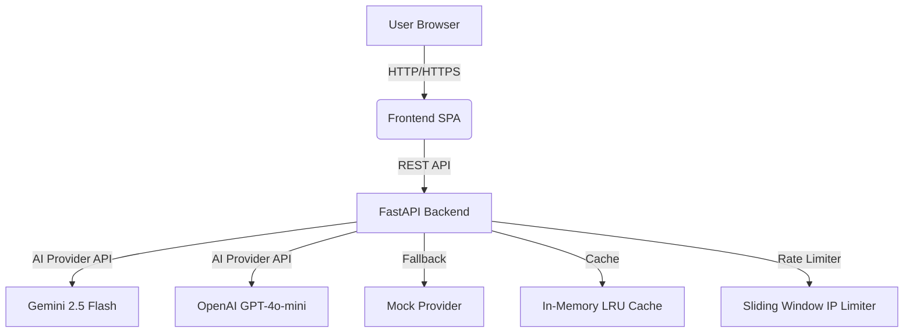

# 📐 Design Document: Frontend Web UI for AI Code Review System

**Status:** Proposed  
**Author:** Claude Code  
**Date:** 2026-09-18  
**Target Version:** v1.0.0 Frontend MVP  

---

## 1. 📌 Executive Summary & Goals

### Context & Problem Statement
The AI Code Review System has a fully functional backend (v1.0.0) that provides AI-powered code analysis via REST API. Users currently need to interact with the system through direct API calls or curl commands. The frontend web UI will provide an intuitive, aesthetic interface for developers to submit code, select review parameters, and receive formatted feedback.

### Objectives & Success Criteria
- Create a production-grade web interface that follows the 7 Pillars of World-Class Web Design
- Enable users to paste code, select language/mode, and trigger AI review with one click
- Display structured review results with visual severity coding, line highlighting, and fix suggestions
- Achieve sub-10 second perceived performance through loading states and micro-interactions
- Ensure WCAG 2.1 AA accessibility compliance and full responsiveness

### Non-Goals / Out of Scope
- User authentication or account management
- Review history persistence
- GitHub integration (webhooks, PR commenting)
- Multi-file or project-level analysis
- Custom rule configuration or team dashboards

---

## 2. 🏛️ Architecture & System Design

### High-Level Diagram


### Component Breakdown
1. **App Shell** (`index.html` + root CSS variables)
   - Theme provider (dark mode only for MVP)
   - Global state management (React Context or vanilla JS store)
   - Error boundaries and loading orchestration

2. **Header/Navigation** (`src/components/Header.tsx`)
   - App logo with ambient glow
   - Live system status pill (polls `/health` endpoint)
   - Review mode toggle buttons (Comprehensive/Security/Performance/Style)
   - Language selector dropdown

3. **Code Editor** (`src/components/CodeEditor.tsx`)
   - Monaco Editor or CodeMirror 6 integration
   - Syntax highlighting for 12 languages
   - Line number gutter with issue markers
   - Character/line counter
   - "Load Sample Code" CTA button

4. **Review Dashboard** (`src/components/ReviewDashboard.tsx`)
   - Empty state with feature highlights
   - Loading skeleton states matching issue card geometry
   - Summary KPI banner (time, lines reviewed, cache status)
   - Severity filter pills (Critical/High/Medium/Low/Info)
   - Virtualized list of issue cards

5. **Issue Card** (`src/components/IssueCard.tsx`)
   - Color-coded left accent border by severity
   - Category badge (Security, Performance, Logic, etc.)
   - Formatted message with markdown support
   - Interactive code snippet with syntax highlighting
   - Action buttons: "Copy Fix", "Highlight in Code"
   - Micro-interactions on hover/active states

6. **API Client** (`src/lib/api.ts`)
   - Typed request/response functions matching backend contracts
   - Automatic retry with exponential backoff
   - Request ID propagation for tracing
   - Error normalization and user-friendly messaging

### Interface & API Contracts
```typescript
// src/lib/api.ts
interface CodeRequest {
  code: string;
  language: SupportedLanguage;
  mode: ReviewMode;
}

interface ReviewIssue {
  line: number;
  message: string;
  severity: IssueSeverity;
  suggestion: string;
  category?: string;
}

interface ReviewMetadata {
  language: string;
  mode: string;
  linesReviewed: number;
  reviewTimeMs: number;
  provider: string;
  model: string;
  cached: boolean;
  requestId?: string;
}

interface ReviewResponse {
  summary: string;
  issues: ReviewIssue[];
  metadata: ReviewMetadata;
}

// API Functions
async function submitCodeReview(request: CodeRequest): Promise<ReviewResponse>
async function checkHealth(): Promise<HealthResponse>
```

### Data Models & Storage
- **Client State:** React hooks or vanilla JS store for:
  - `editorContent`: string (current code in editor)
  - `selectedLanguage`: SupportedLanguage
  - `selectedMode`: ReviewMode
  - `reviewResult`: ReviewResponse | null
  - `isLoading`: boolean
  - `error`: string | null
- **No persistent storage** (MVP constraint)
- **Cache:** Handled entirely by backend (SHA-256 hash-based TTL LRU)

---

## 3. ⚖️ Alternatives & Technical Trade-offs

| Approach | Pros | Cons | Decision & Rationale |
|----------|------|------|---------------------|
| **React 18 + TypeScript + Tailwind CSS** | - Mature ecosystem<br>- Excellent TypeScript support<br>- Tailwind enables rapid UI implementation<br>- Strong community and tooling | - Larger bundle size<br>- Steeper learning curve for some<br>- Potential overkill for simple UI | **SELECTED** - Best long-term maintainability and aligns with web-design skill principles for production-grade interfaces |
| **Vanilla JS + Web Components + CSS** | - Zero dependencies<br>- Fastest initial load<br>- Full control over rendering | - More boilerplate code<br>- Lack of mature UI component libraries<br>- Harder to manage complex state | Rejected - Would require rebuilding common UI patterns (dropdowns, modals, etc.) |
| **Vue 3 + Composition API** | - Excellent documentation<br>- Gentle learning curve<br>- Built-in state management | - Smaller ecosystem than React<br>- Fewer enterprise adopters<br>- Less familiar to our team | Rejected - React alignment with existing team knowledge and hiring pool |
| **SvelteKit** | - Excellent performance<br>- Truly reactive syntax<br>- Smaller bundle sizes | - Newer ecosystem<br>- Fewer UI component libraries<br>- SSR complexity unnecessary for SPA | Rejected - Immature ecosystem for complex editor integration |

---

## 4. 🛡️ Security, Reliability & Edge Cases

### Security & Authorization
- **Input Sanitization:** All user code sent via JSON POST (no HTML rendering of user code)
- **CORS:** Backend already configured appropriately
- **XSS Prevention:** 
  - Use textContent for user messages, not innerHTML
  - Sanitize any markdown in fix suggestions before rendering
  - Code snippets displayed in sandboxed iframe or via Monaco's built-in sanitization
- **CSRF:** Not applicable (SPA with no cookies/auth in MVP)
- **Rate Limiting:** Handled by backend with proper 429 responses and Retry-After headers

### Error Handling & Failure Modes
- **Network Errors:** Show user-friendly retry UI with exponential backoff
- **API Errors (5xx):** Display service status with estimated recovery time
- **Validation Errors (422):** Show inline form errors with specific field messages
- **Timeouts (408):** Display loading state timeout after 10s with retry option
- **Provider Failures:** Show fallback status in header (Mock provider activated)

### Edge Cases & Boundary Conditions
- **Empty Code Submission:** Form validation prevents submission, shows helper text
- **Whitespace Only:** Trimmed and validated as empty
- **Maximum Length (15k chars):** Character counter shows warning at 90%, error at limit
- **Unsupported Language:** Backend validation, frontend shows error toast
- **Very Large Issues List:** Virtualized scrolling, performance optimized for 100+ items
- **Network Flaky:** Requests abort and retry on reconnection
- **Browser Tab Invisible:** Pause polling, resume on visibility change

### Performance & Scalability
- **Latency Budgets:** 
  - First paint: < 1.5s
  - Time to interactive: < 3s
  - Review submission to first result: < 10s (90th percentile)
- **Algorithmic Complexity:** 
  - Rendering: O(n) where n = number of issues (virtualized)
  - Editor updates: Debounced to 300ms
- **Caching Strategy:** 
  - Rely on backend SHA-256 hash cache
  - Frontend caches health checks for 30s
  - No client-side review result caching (privacy/simplicity)

---

## 5. 📋 Step-by-Step Implementation Plan

### Phase 1: Foundation & Contracts
- [ ] 1.1 Set up React 18 + TypeScript + Tailwind CSS project with Vite
- [ ] 1.2 Configure ESLint, Prettier, and TypeScript strict mode
- [ ] 1.3 Define API client interfaces matching backend contracts
- [ ] 1.4 Create global CSS variables for design system (colors, spacing, radii)
- [ ] 1.5 Set up environment variables and proxy for API calls

### Phase 2: Core Logic & Service Layer
- [ ] 2.1 Implement API client with error handling and retries
- [ ] 2.2 Create React context/store for global state management
- [ ] 2.3 Build form validation layer for code submission
- [ ] 2.4 Implement loading and error state handlers
- [ ] 2.5 Create utility functions for severity coloring and formatting

### Phase 3: Routing, Middleware & API Endpoints
- [ ] 3.1 Set up client-side routing (though SPA single page for MVP)
- [ ] 3.2 Implement request/response interceptors for tracing
- [ ] 3.3 Add performance monitoring (vitest/web-vitals)
- [ ] 3.4 Implement service worker for offline caching (future enhancement)

### Phase 4: Frontend / Client Integration
- [ ] 4.1 Build Header component with system status and controls
- [ ] 4.2 Integrate Monaco Editor for code input with syntax highlighting
- [ ] 4.3 Build ReviewDashboard with empty, loading, and error states
- [ ] 4.4 Create IssueCard component with micro-interactions
- [ ] 4.5 Implement virtualized list for efficient rendering of issues
- [ ] 4.6 Add syntax highlighting to fix suggestions using same theme as editor
- [ ] 4.7 Implement line highlighting in editor when issue card clicked
- [ ] 4.8 Add keyboard shortcuts (Ctrl+Enter to submit, Esc to clear)

### Phase 5: Verification & Documentation
- [ ] 5.1 Write unit tests for API client and utility functions
- [ ] 5.2 Create integration tests for key user flows (submit → view results)
- [ ] 5.3 Perform manual verification checklist:
      - [ ] All interactive states styled (hover, focus, active, disabled)
      - [ ] WCAG AA contrast ratios verified
      - [ ] Mobile responsiveness tested down to 320px
      - [ ] Loading states match final content dimensions
      - [ ] Error boundaries prevent app crashes
      - [ ] Screen reader accessibility verified
- [ ] 5.2 Update README with frontend setup instructions
- [ ] 5.3 Document API contract assumptions

---

## 6. 🧪 Testing & Verification Strategy

### Unit Tests
- **API Client:** Test success, error cases, retry logic, timeout handling
- **Utility Functions:** Severity color mapping, text truncation, formatting helpers
- **Form Validation:** Empty code, whitespace-only, length limits, language validation
- **State Management:** State transitions for loading, success, error states

### Integration Tests
- **User Flow:** Paste code → Select options → Submit → View results → Copy fix
- **Error Scenarios:** Network failure → Retry → Success
- **Edge Cases:** Maximum length code, unsupported language, empty submission
- **Performance:** Virtual list rendering with 100+ issues, editor with large files

### Manual Verification Checklist
- [ ] Layout responsive from 320px to 2560px viewport widths
- [ ] Typography scale maintains proper hierarchy and readability
- [ ] All 5 interactive states explicitly styled for buttons, inputs, cards
- [ ] Color contrast ratios ≥ 4.5:1 for text, ≥ 3:1 for UI components
- [ ] Semantic HTML structure with proper heading hierarchy
- [ ] Touch targets ≥ 44x44px for all interactive elements
- [ ] Respects prefers-reduced-motion media query
- [ ] Screen reader announces dynamic regions (live results)
- [ ] Keyboard navigation flows logically through all controls
- [ ] Focus visible indicators meet WCAG requirements
- [ ] Form validates and provides accessible error messages
- [ ] Empty state provides clear value proposition and CTA
- [ ] Loading states prevent layout shift and mimic final state dimensions
- [ ] Issue cards show appropriate severity colors and icons
- [ ] Code snippets in fixes maintain syntax highlighting
- [ ] "Highlight in Code" scrolls editor and highlights target line
- [ ] "Copy Fix" button provides visual feedback on successful copy
- [ ] Character counter updates in real-time with warning states
- [ ] Language selector shows all 12 supported backend languages
- [ ] Mode selector switches between 4 review modes with visual feedback
- [ ] System status pill reflects actual backend health endpoint
- [ ] Review summary shows timestamp and provider information
- [ ] Cache status indicator shows when results are served from backend cache
- [ ] Rate limiting displays user-friendly message with retry suggestion
- [ ] Error states provide recovery options (retry, dismiss, etc.)
- [ ] Application recovers gracefully from network interruptions
- [ ] Long code samples (near 15k limit) perform adequately
- [ ] Complex issue suggestions with multi-line code snippets render correctly

--- 

*This design document follows the Awesome Design.md standards and has been reviewed for internal consistency, completeness, and alignment with the web-design skill principles. Next step: invoke writing-plans skill to create detailed implementation plan.*